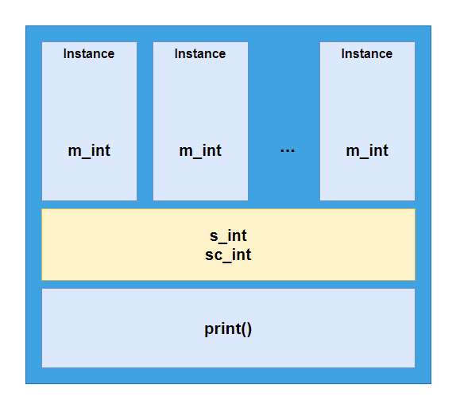

# Static Members(정적 멤버 변수& 정적 멤버 함수)

## 1. 정적 멤버 변수

일반적으로 각 객체는 자신만의 고유한 데이터(인스턴스 멤버 변수)를 가진다. 이와 달리 모든 객체가(즉, 클래스 전체가) 공유하는 변수를 선언할 수 있는데 이를 **정적 멤버 변수(Static Member Variable)** 라 한다.

정적 멤버 변수는 **`static`** 접두 키워드를 이용해 선언할 수 있다.

```c++
/* Test.h */

class Test
{
    public:
    int m_int = 3;
    static int s_int;
    static constexpr int sc_int = 5;
    
    void print() const;
};
```

위 코드에서 각 변수는 다음과 같다.

*   m_int : 인스턴스 멤버 변수
*   s_int : 정적 멤버 변수
*   sc_int : 정적 멤버 상수

정적 멤버들은 클래스의 모든 인스턴스가 공유하므로, 다음과 같은 구조이다.



각 인스턴스들은 자신만의 고유한 m_int를 가지지만, s_int와 sc_int는 모두가 함께 사용한다.

```c++
//...

int Test::s_int = 3;    // 정적 변수 초기화

int main()
{
    std::cout << &Test::s_int << " " << Test::s_int << std::endl;
    
    Test t1;
    Test t2;
    
    std::cout << &t1.s_int << " " << t1.s_int++ << std::endl;
    std::cout << &t2.s_int << " " << t2.s_int++ << std::endl;
    
    return 0;
}
```

위 코드의 결과는 다음과 같다.

```text
0B842A64 3
0B842A64 3
0B842A64 4
```

살펴볼 점은 다음과 같다.

*   **정적 변수 초기화는 클래스 내부에서 하지 않는다.**

    정적 변수의 경우, 클래스 내부에서 초기화가 불가능하다. 이유는 다음과 같다.

    *   클래스 내부에서 초기화 코드를 작성하면 인스턴스가 생성될 때마다 정적 변수가 초기화되어야 하는데, 이미 존재하는 정적 변수를 다시 초기화할 수 없기 때문이다.
    *   정적 변수는 인스턴스와 상관 없이 클래스 단위의 데이터인데, 인스턴스가 생성되어야만 해당 변수가 초기화된다면 클래스만으로 사용할 수 없게 된다.

    따라서 **정적 멤버 변수의 초기화는 클래스의 정의 부분(*.cpp)에서 해 주게 된다.**

    단, **정적 멤버 상수의 경우 선언과 동시에 초기화가 되어야 하기 때문에 클래스 내부에서 초기화가 가능**하다.

*   **클래스와 범위 지정 연산자**만을 이용해 **인스턴스 없이 접근할 수 있다.**

*   **두 인스턴스에서 각각 호출한 s_int의 주소가 동일**하며, **동일한 값을 공유**한다(t1의 s_int를 증가시켰더니 t2의 s_int도 증가되어 있다).

## 2. 정적 멤버 함수

정적 멤버 변수를 public으로 선언한 경우에는 아무 제약 없이 접근 가능하다.

그러나 정적 멤버 변수가 private으로 선언되었다면 직접 접근이 불가능해진다.

어쨌든 각 인스턴스는 정적 멤버 변수에 접근할 수 있으므로 정적 멤버 변수에 간접적으로 접근하도록 하는 인스턴스 멤버 변수를 생성해도 되지만, 이 경우 클래스만으로 정적 멤버 변수에 접근하는 것은 불가능하다.

**정적 멤버 함수(Static Member Function)** 는 별도의 인스턴스 없이 호출할 수 있는 멤버 함수이다.

```c++
class Test
{
    private:
    int _value = 3;
    static int s_value;
    
    public:
    int GetValue() const
    {
        return _value;
    }
    
    static int GetStaticValue()
    {
        return s_value;
    }
}

int Test::s_value = 31;

int main()
{    
    std::cout << Test::GetStaticValue() << std::endl; 
    
    Test t1;
    Test t2;
    
    std::cout << t1.GetStaticValue() << std::endl;
    std::cout << t2.GetStaticValue() << std::endl;
    
    return 0;
}
```

출력 결과는 다음과 같다.

```text
31
31
31
```

살펴볼 점은 다음과 같다.

*   **정적 멤버 함수** 역시 정적 멤버 변수와 마찬가지로 **클래스와 범위 지정 연산자만으로 호출할 수 있으며, 각 인스턴스를 통해서도 호출할 수 있다.**

*   정적 멤버 함수는 **const 한정자를 사용할 수 없다.**

    const 한정자는 함수를 공유하는 인스턴스 중 특정 인스턴스가 함수를 사용하려고 this 포인터를 넘겨줄 때 해당 인스턴스가 가진 멤버 변수를 변경하지 않도록 this 포인터에 const를 지정해 주는 것인데, 정적 멤버 함수는 별도의 this 포인터 전달이 없으므로 const를 붙일 수가 없다.

*   정적 멤버 함수에서는 **정적 멤버 변수만을 이용할 수 있다**. 인스턴스 없이 호출해야 하는데 인스턴스 멤버를 쓸 순 없으니까.

## 3. 멤버 함수 포인터

정적 멤버 변수와 인스턴스 멤버 변수는 각 인스턴스가 공유하는지, 아니면 각자의 고유한 데이터를 가지는지에 대한 차이가 존재했지만, 정적 멤버 함수와 인스턴스 멤버 함수는 둘 다 모든 인스턴스가 공유하도록 되어 있다.

그러나 두 함수의 차이는 **this 포인터**를 전달 유무이므로, **const 한정자 뿐만 아니라 함수 포인터를 사용할 때에도 차이가 존재**하게 된다.

또한 멤버 함수는 비 멤버 함수와도 함수 포인터의 사용 방식에 차이가 있다.

비 멤버 함수(Non-member Function)의 경우 다음과 같이 함수 포인터를 사용했다.

```c++
#include <functional>

int temp()
{
    // Return Something
}

int main()
{
    // int (*fptr)() = temp; 도 가능
    int (*fptr)() = &temp;
    
    // C++11의 function 객체의 경우
    std::function<int()> fobj = &temp;
    
    return 0;
}
```

비 멤버 함수는 전역 공간에 정의되어 있기 때문에 별도의 범위 지정이 필요하지 않은 반면, 멤버 함수는 다음처럼 범위 지정이 필요하다.

```c++
#include <functional>

class Test
{
    public:
    int temp() const
    {
        // Return Something
    }
};

int main()
{
    // & 없이 함수 포인터 사용 불가. 함수와 함수포인터에 어떤 클래스의 함수를 가리키는지 범위를 명시해야 함.
    int (Test::*fptr)() = &Test::temp;
    
    // C++11의 function 객체의 경우 - Test* 는 Test 타입 인스턴스의 this 포인터를 의미함.
    std::function<int(Test*)> fobj = &Test::temp;
    
    // 멤버 함수를 호출할 때 특정 인스턴스를 binding하고 싶은 경우(자동으로 해당 인스턴스의 this 포인터가 들어가도록)
    // std::bind를 이용
    Test t;
    
    std::function<int()> fBoundObj = std::bind(&Test::temp, t);
    
    return 0;
}
```

정적 멤버 함수의 경우, this 포인터가 전달되지 않기 때문에 오히려 비 멤버 함수처럼 사용해야 한다.

다만, 클래스에 소속되어 있는 함수이므로 함수명 앞에 클래스명을 범위로 명시해야 한다.

```c++
#include <functional>

class Test
{
    public:
    static int temp()
    {
        // Return Something
    }
};

int main()
{
    // int (*fptr)() = Test::temp; 도 가능
    int (*fptr)() = &Test::temp;
    
    // C++11의 function 객체의 경우
    std::function<int()> fobj = Test::temp;
    
    return 0;
}
```

---

>   *참고 자료(Reference)*
>
>   [std::bind - cppreference.com](https://en.cppreference.com/w/cpp/utility/functional/bind)